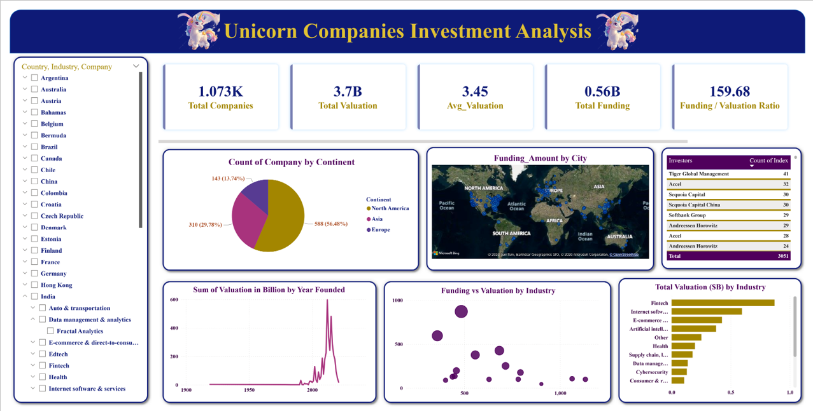

# 🦄 Unicorn Companies Investment Analysis

## 🚀 Project Highlights
- Built an interactive Power BI dashboard to analyze unicorn companies globally  
- Evaluated investment trends using valuation, funding, and investor data  
- Identified high-growth industries and regions for investment opportunities  
- Developed a funding efficiency metric to assess capital utilization  
- Delivered clear, data-driven insights for investment decision-making  

---

## 🎯 Project Overview
This project analyzes unicorn companies to identify high-potential investment opportunities based on valuation, funding, industry trends, and geographic distribution.

The dashboard enables users to explore company performance, compare industries, and evaluate funding efficiency using interactive filters and visualizations.

---

## 📂 Dataset
- Unicorn Companies Dataset  
- Funding Dataset  
- Investors Dataset  
- Combined and analyzed using Power BI  

---

## 🧹 Data Preparation
- Cleaned and standardized company, country, and industry data  
- Removed inconsistencies and handled missing values  
- Merged datasets using Company as the key  
- Created calculated measures for valuation and funding analysis  

---

## 📊 Key Metrics (KPIs)
- **Total Companies:** 1,073  
- **Total Valuation:** $3.7B  
- **Average Valuation:** 3.45  
- **Total Funding:** $0.56B  
- **Funding-to-Valuation Ratio:** 159.68  

---

## 📊 Dashboard Features
- KPI cards for overall investment overview  
- Country, industry, and company-level filtering  
- Geographic visualization of funding by city  
- Industry-wise valuation comparison  
- Funding vs valuation scatter analysis  
- Year-wise valuation growth trends  
- Top investors analysis  

---

## 🔍 Key Insights
- North America leads in the number of unicorn companies and funding activity  
- FinTech and Internet Software are the top-performing industries in terms of valuation  
- Companies with high valuation and relatively lower funding indicate strong capital efficiency  
- Investment activity is concentrated in a few major global startup hubs  
- Valuation growth has increased significantly in recent years  

---

## 💡 Business Impact
- Helps investors identify high-growth industries and regions  
- Supports evaluation of company performance based on funding efficiency  
- Enables comparison of investment opportunities across industries  
- Assists in making data-driven investment decisions  

---

## 📈 Investment Recommendations
- Focus on high-growth industries such as FinTech and Internet Software  
- Prioritize regions with strong startup ecosystems (e.g., North America)  
- Identify companies with high valuation but optimized funding  
- Track industries with consistent growth trends  

---

## 📊 Dashboard
👉 [View Full Dashboard](Dashboard/unicorn_dashboard.pdf)

---

## 📸 Dashboard Preview

---

## 🛠️ Tools & Technologies
- Power BI  
- DAX  
- Excel  

---

## ▶️ How to Run the Project
1. Clone the repository  
2. Open the Power BI (.pbix) file  
3. Use filters to explore insights across industries, countries, and companies  

---

## 🚀 Future Enhancements
- Add predictive analysis for valuation growth  
- Enhance dashboard with drill-through and tooltips  
- Include real-time startup data integration  

---
